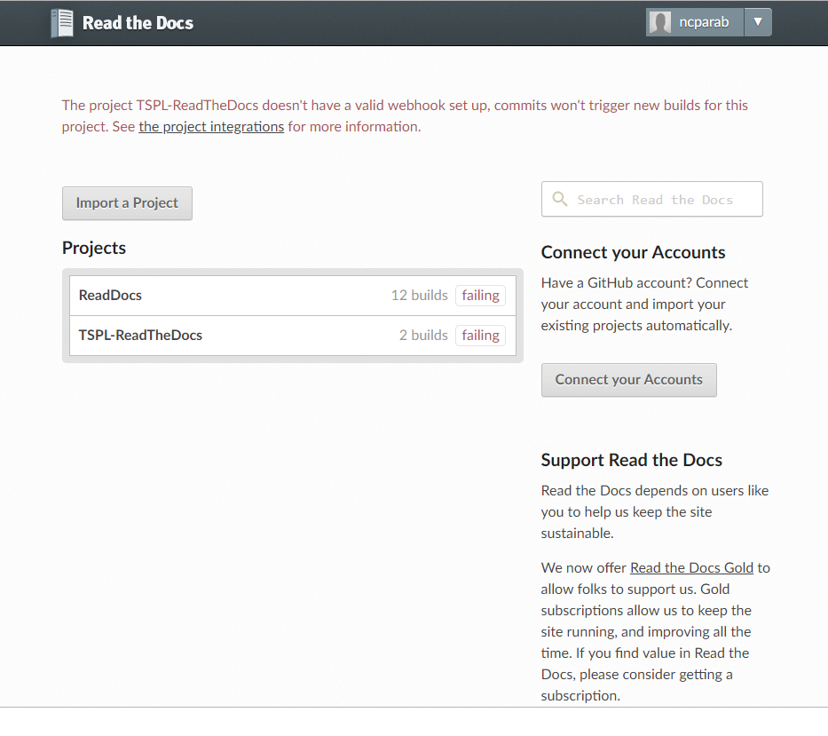

##################################
Get and run Read The Docs
##################################

Install and Clone the repository somewhere on your disk and enter to the repository:
------------------------------------------------------------------------------------

.. code-block:: bash

       $sudo yum install python-devel python-pip libxml2-devel libxslt-devel

.. code-block:: bash

       $git clone https://github.com/rtfd/readthedocs.org.git

       $cd readthedocs.org

- Create a virtual environment and activate it:

.. code-block:: bash

       $virtualenv venvsource 

       $venv/bin/activate

- Next, install the dependencies using pip (make sure you are inside of the virtual environment):

.. code-block:: bash

       $pip install -r requirements.txt

- This may take a while, so go grab a beverage. When it’s done, build the database:

.. code-block:: bash

       $python manage.py migrate

- Then create a superuser account for Django:(Use the credential same as github username,email and password)

.. code-block:: bash

       $python manage.py createsuperuser

- Now let’s properly generate the static assets:

.. code-block:: bash

       $python manage.py collectstatic

- Now you can optionally load a couple users and test projects:
 
.. code-block:: bash

       $python manage.py loaddata test_data

- Finally, you’re ready to start the web server:

.. code-block:: bash

       $python manage.py runserver

- Visit http://127.0.0.1:8000/ in your browser to see how it looks; you can use the admin interface via http://127.0.0.1:8000/admin (logging in with the superuser account you just created).

- After registering with the site (or creating yourself a superuser account), you will be able to log in and view the dashboard.

